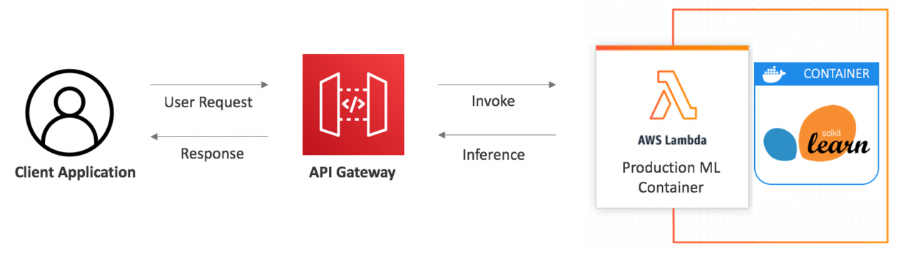

# CSC4160 Assignment 3: Model Serving with AWS Lambda and Cold Start Performance Analysis (6 points)

### Deadline: October 24, 2024, 23:59

### Name:

### Student ID:

---

## Overview

In this assignment, you will learn to deploy a machine learning model as a serverless application using AWS Lambda and API Gateway. You will create Docker images, push them to Amazon Elastic Container Registry (ECR), and conduct load testing on your deployed application. Additionally, you will analyze the cold start phenomenon associated with serverless functions.

We will use the well-known IRIS dataset to keep the machine learning model simple and focused on the serverless deployment process. The dataset includes four features: sepal length, sepal width, petal length, and petal width, and classifies samples into three categories: Iris Setosa, Iris Versicolour, and Iris Virginica.



### Components

1. **Lambda Function Development**

   - Implement the `lambda_handler` function.

2. **Environment Setup**

   - Install Docker and AWS CLI.

3. **Docker Image Creation**

   - Make a Docker Image that will generate prediction using a trained model.

4. **ECR Repository Setup**

   - Create an AWS ECR repository and push your Docker image to AWS ECR.

5. **Lambda Function Creation in AWS Console**

   - Create a Lambda function using the container image.

6. **API Gateway Configuration**

   - Using the API gateway to access the prediction API

7. **Load Testing and Analysis**

   - Use Locust to perform load testing on your deployed API.
   - Plot the results to observe the cold start trend.
   - Analyze the differences between cold start and warm request response times.

## Instructions

### 1. Lambda Function Development

You will be provided with the `predict` function and the model file; your task is to implement the `lambda_handler` function.

The lambda_handler function performs the following tasks:

- Extracts the `values`: It retrieves the values input from the incoming event, which are the features used for making predictions.
- Calls the predict function: It invokes the predict function, passing the extracted values to generate predictions based on the machine learning model.
- Return the prediction result: Finally, it formats the prediction results as a JSON response and returns them to the caller.

### 2. Environment Setup

- Ensure Docker and AWS CLI are installed.

### 3. Docker Image Creation

- Use the provided Dockerfile to create a Docker image:

  ```bash
  docker build -t iris_image .
  ```

- Run the Docker container locally:

  ```bash
  docker run -it --rm -p 8080:8080 iris_image:latest
  ```

  Here, we are mapping port 8080.

- Verify if the image is functioning properly by executing `test.py`.

### 4. ECR Repository Setup

- Create an ECR repository:
  ```bash
  aws ecr create-repository --repository-name iris-registry
  ```
- Authenticate your Docker client with ECR:
  ```bash
  aws ecr get-login-password --region us-east-1 | docker login --username AWS --password-stdin <aws_account_id>.dkr.ecr.us-east-1.amazonaws.com
  ```
- Get image id:
  ```bash
  docker image ls
  ```
- Tag and push your Docker image:

  ```bash
  docker tag <image_id> <aws_account_id>.dkr.ecr.us-east-1.amazonaws.com/iris-registry:latest

  docker push <aws_account_id>.dkr.ecr.us-east-1.amazonaws.com/iris-registry:latest
  ```

### 5. Lambda Function Creation in AWS Console

- Create the Lambda function using the existing container image you have built and select `LabRole` as the execution role.

### 6. API Gateway Configuration

- Create an REST API for your Lambda function using API Gateway.
- Test your API using `curl` (Linux):

  ```bash
  curl --header "Content-Type: application/json" --request POST --data "{\"values\": [[<value1>, <value2>, <value3>, <value4>]]}" https://<your_api_id>.execute-api.<region>.amazonaws.com/default/<your_lambda_function>

  ```

  or using `Invoke-WebRequest` (Windows):

  ```bash
  Invoke-WebRequest -Method Post -Uri "https://<your_api_id>.execute-api.<region>.amazonaws.com/default/<your_lambda_function>" `
   -Headers @{ "Content-Type" = "application/json" } `
   -Body '{"values": [[<value1>, <value2>, <value3>, <value4>]]}'
  ```

### 7. Load Testing and Analysis

#### Load Testing

Use the provided Locust load test script to evaluate the performance of your deployed API.

- Install Locust

```bash
pip install locust
```

- Run the Locust test using:

```bash
locust -f locustfile.py --host https://<your_api_gateway_id>.execute-api.us-east-1.amazonaws.com --users 100 --spawn-rate 20 --run-time 60s --csv "locust_logs/test" --csv-full-history --html "locust_logs/test_locust_report.html" --logfile "locust_logs/test_locust_logs.txt" --headless
```

For Windows users, set the PATH for `locust`, or directly use the `locust.exe`, specifying its path, e.g.:

```bash
c:\users\user\appdata\roaming\python\python39\scripts\locust.exe
```

#### Analysis

Analyze the results using the performance analysis notebook on Google Colab. Upload your logs and run the notebook `performance_analysis.ipynb`. Fill in the estimated cold start time (in `<FILL IN>`) before graphing the histogram to compare response times during cold start and warm requests.

You will receive 1 point for including the required figures in your `.ipynb`: a line graph, a histogram of cold starts, and a histogram of warm requests. Additionally, 0.5 points will be awarded for providing a clear explanation of your analysis.

## Questions

### Understanding AWS Lambda, API Gateway, and ECR

1. **AWS Lambda Function** (0.5 point):

   What is the role of a Lambda function in serverless deployment? How does the `lambda_handler` function work to process requests?

   **Answer**: &lt;You answer goes here&gt;.

2. **API Gateway and Lambda Integration** (0.5 point):

   Explain the purpose of API Gateway in this deployment process. How does it route requests to the Lambda function?

   **Answer**: &lt;You answer goes here&gt;.

3. **ECR Role** (0.5 point):

   What is the role of ECR in this deployment? How does it integrate with Lambda for managing containerized applications?

   **Answer**: &lt;You answer goes here&gt;.

### Analysis of Cold Start Phenomenon

4. **Cold Start Versus Warm Requests** (1 Point):

   Provide your analysis comparing the performance of requests during cold starts versus warm requests (based on the line graph and histograms you obtained in `performance_analysis.ipynb`). Discuss the differences in response times and any notable patterns observed during your load testing.

   **Answer**: &lt;You answer goes here&gt;.

5. **Implications and Strategies** (0.5 Point):

   Discuss the implications of cold starts on serverless applications and how they affect performance. What strategies can be employed to mitigate these effects?

   **Answer**: &lt;You answer goes here&gt;.

## Submission Requirements

Please submit your assignment via GitHub Classroom. Commit and push the following files to your GitHub Classroom repository:

- `README.md` (with all questions answered) (3 points)
- `lambda_function.py` (your implementation of the Lambda function) (1 point)
  - Extracts the `values`
  - Calls the predict function
  - Return the prediction result
- A screenshot of the CloudWatch log event for one of your Lambda function invocations. (0.5 point)
- A screenshot of a successful request and response using `curl` or `Invoke-WebRequest`, showing the correct prediction output. (0.5 point)
- `performance_analysis.ipynb`, including:
  - Figure of the line graph, cold start histogram, and warm request histogram. (0.5 point)
- `test_locust_logs.txt` (Locust load test logs) (0.5 point)

## Author

This assignment was created by Juan Albert Wibowo on October 8, 2024, for CSC4160: _Cloud Computing_, Fall 2024 at CUHKSZ.
