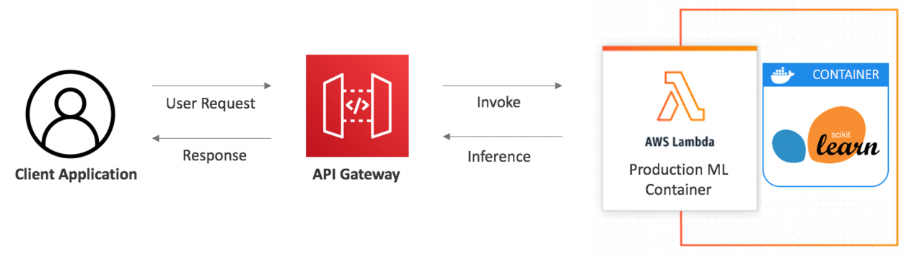

# CSC4160 Assignment 3: Model Serving with AWS Lambda and Cold Start Performance Analysis (6 points)

### Deadline: October 24, 2024, 23:59

### Name:

### Student ID:

---

## Overview

In this assignment, you will learn to deploy a machine learning model as a serverless application using AWS Lambda and API Gateway. You will create Docker images, push them to Amazon Elastic Container Registry (ECR), and conduct load testing on your deployed application. Additionally, you will analyze the cold start phenomenon associated with serverless functions.

We will use the well-known IRIS dataset to keep the machine learning model simple and focused on the serverless deployment process. The dataset includes four features: sepal length, sepal width, petal length, and petal width, and classifies samples into three categories: Iris Setosa, Iris Versicolour, and Iris Virginica.



### Components

1. **Lambda Function Development**

   - Implement the `lambda_handler` function.

2. **Environment Setup**

   - Set up your local development environment.

3. **Docker Image Creation**

   - Make a Docker Image that will generate prediction using a trained model.

4. **ECR Repository Setup**

   - Create an AWS ECR repository and push your Docker image to AWS ECR.

5. **Lambda Function Creation in AWS Console**

   - Create a Lambda function using the container image.

6. **API Gateway Configuration**

   - Using the API gateway to access the prediction API

7. **Load Testing and Analysis**

   - Use Locust to perform load testing on your deployed API.
   - Plot the results to observe the cold start trend.
   - Analyze the differences between cold start and warm request response times.

## Instructions

### 1. Lambda Function Development

You will be provided with the `predict` function and the model file; your task is to implement the `lambda_handler` function.

The lambda_handler function performs the following tasks:

- Extracts the `values`: It retrieves the values input from the incoming event, which are the features used for making predictions.
- Calls the predict function: It invokes the predict function, passing the extracted values to generate predictions based on the machine learning model.
- Return the prediction result: Finally, it formats the prediction results as a JSON response and returns them to the caller.

<details>
  <summary>Steps to Implement <code>lambda_handler</code></summary>

#### Extract Input from Event:

- You will receive the input features inside the `body` of the event.
- Parse this `body` as JSON and retrieve the `values`.
- You could also handle any possible errors, like missing input or invalid JSON.

#### Call the `predict` Function:

- After extracting the `values`, pass them to the `predict` function, which will return a list of predictions.

#### Format and Return the Response:

- Return the predictions as a JSON response.
</details>

<details>
   <summary>Testing the function</code></summary>

#### Test with Mock Input:

You can simulate the input to the `lambda_handler` via the AWS Lambda console. For example, an event might look like this:

```bash
{
  "body": "{\"values\": [[5.1, 3.5, 1.4, 0.2]]}"
}
```

#### Simulate predict:

If you want to test without uploading the model, you can temporarily simulate the predict function to return a mock result.

#### Test in AWS Lambda:

Use the AWS Lambda Console to test your function with a sample event, or you can set up API Gateway and send a request from there.

</details>

### 2. Environment Setup

Set up your local development environment on your machine:

- Install Docker Desktop for your operating system: https://www.docker.com/
- Install the AWS CLI: https://docs.aws.amazon.com/cli/latest/userguide/getting-started-install.html
- Ensure you have Python 3 and pip installed.
- (Optional but Recommended) Install Git: https://git-scm.com/downloads
- Configure your AWS credentials:

  <details>
  <summary>AWS credentials configuration</summary>

  #### To configure your AWS credentials, follow these steps:

  1. **Access your AWS credentials**: On the Vocareum main page, navigate to "Account details" then "AWS CLI." Copy the provided Access Key ID, Secret Access Key, and Session Token.

  2. **Create or open the credentials file**: Locate your AWS credentials file:

     - **macOS**: `~/.aws/credentials`
     - **Windows**: `C:\Users\%UserProfile%\.aws\credentials`

     If the file doesn't exist, create it using a plain text editor.

  3. **Add your credentials**: Paste the Access Key ID, Secret Access Key, and Session Token into the file, using the following format. Add the `region` line (you can use any region, e.g., `us-east-1`):

     ```ini
     [default]
     region=us-east-1  # Add this line.
     aws_access_key_id=YOUR_ACCESS_KEY_ID
     aws_secret_access_key=YOUR_SECRET_ACCESS_KEY
     aws_session_token=YOUR_SESSION_TOKEN
     ```

     Replace `YOUR_ACCESS_KEY_ID`, `YOUR_SECRET_ACCESS_KEY`, and `YOUR_SESSION_TOKEN` with the values you copied from Vocareum.

  4. **Save the file**: Ensure the file is saved, and only you have access to it.

  5. **Important Security Note**: Never share your AWS credentials. Treat them like passwords. Do not commit this file to version control (e.g., Git). Add `.aws/credentials` to your `.gitignore` file. Consider using a more secure method of managing credentials in production environments.

  </details>

### 3. Docker Image Creation

Before building the Docker image, ensure the Docker daemon is running (start Docker Desktop on Windows/macOS or use `sudo systemctl start docker` on Linux).

In your local machine:

- Use the provided Dockerfile to create a Docker image:

  ```bash
  docker build -t iris_image .
  ```

- Run the Docker container locally:

  ```bash
  docker run -it --rm -p 8080:8080 iris_image:latest
  ```

  Here, we are mapping port 8080.

- Verify if the image is functioning properly by executing `test.py`.

### 4. ECR Repository Setup

Begin by launching your AWS Academy Learner Lab and ensuring your AWS credentials are correctly configured. Then, on your local computer, proceed with the following steps.

- Create an ECR repository:
  ```bash
  aws ecr create-repository --repository-name iris-registry
  ```
- Authenticate your Docker client with ECR:
  ```bash
  aws ecr get-login-password --region us-east-1 | docker login --username AWS --password-stdin <aws_account_id>.dkr.ecr.us-east-1.amazonaws.com
  ```
- Get image id:
  ```bash
  docker image ls
  ```
- Tag and push your Docker image:

  ```bash
  docker tag <image_id> <aws_account_id>.dkr.ecr.us-east-1.amazonaws.com/iris-registry:latest

  docker push <aws_account_id>.dkr.ecr.us-east-1.amazonaws.com/iris-registry:latest
  ```

### 5. Lambda Function Creation

- In AWS console, create the Lambda function using the existing container image you have built and select `LabRole` as the execution role.

### 6. API Gateway Configuration

- Create an REST API for your Lambda function using API Gateway via AWS console.
- Test your API in your local machine using `curl` (Linux):

  ```bash
  curl --header "Content-Type: application/json" --request POST --data "{\"values\": [[<value1>, <value2>, <value3>, <value4>]]}" https://<your_api_id>.execute-api.<region>.amazonaws.com/default/<your_lambda_function>

  ```

  or using `Invoke-WebRequest` (Windows):

  ```bash
  Invoke-WebRequest -Method Post -Uri "https://<your_api_id>.execute-api.<region>.amazonaws.com/default/<your_lambda_function>" `
   -Headers @{ "Content-Type" = "application/json" } `
   -Body '{"values": [[<value1>, <value2>, <value3>, <value4>]]}'
  ```

### 7. Load Testing and Analysis

#### Load Testing

In your local machine, use the provided Locust load test script to evaluate the performance of your deployed API.

- Install Locust

```bash
pip install locust
```

- Navigate to the directory containing `locustfile.py`.
- Run the Locust test using:

```bash
locust -f locustfile.py --host https://<your_api_gateway_id>.execute-api.us-east-1.amazonaws.com --users 10 --spawn-rate 5 --run-time 60s --csv "locust_logs/test" --csv-full-history --html "locust_logs/test_locust_report.html" --logfile "locust_logs/test_locust_logs.txt" --headless
```

For Windows users, set the PATH for `locust`, or directly use the `locust.exe`, specifying its path, e.g.:

```bash
c:\users\user\appdata\roaming\python\python39\scripts\locust.exe -f locustfile.py --host https://<your_api_gateway_id>.execute-api.us-east-1.amazonaws.com --users 10 --spawn-rate 5 --run-time 60s --csv "locust_logs/test" --csv-full-history --html "locust_logs/test_locust_report.html" --logfile "locust_logs/test_locust_logs.txt" --headless
```

#### Analysis

Analyze the results using the performance analysis notebook on Google Colab. Upload your logs and run the notebook `performance_analysis.ipynb`. Fill in the estimated cold start time (in `<FILL IN>`) before graphing the histogram to compare response times during cold start and warm requests.

You will receive 1 point for including the required figures in your `.ipynb`: a line graph, a histogram of cold starts, and a histogram of warm requests. Additionally, 0.5 points will be awarded for providing a clear explanation of your analysis.

## Questions

### Understanding AWS Lambda, API Gateway, and ECR

1. **AWS Lambda Function** (0.5 point):

   What is the role of a Lambda function in serverless deployment? How does the `lambda_handler` function work to process requests?

   **Answer**: A compute service that allows me to run code without provisioning or managing servers. When a request is made, AWS Lambda passes the event data to the lambda_handler function. This function extracts input values, processes them (e.g., by invoking a machine learning prediction function), and returns a formatted response.

2. **API Gateway and Lambda Integration** (0.5 point):

   Explain the purpose of API Gateway in this deployment process. How does it route requests to the Lambda function?

   **Answer**: the purpose of AWS API Gateway is to act as a frontend interface for the deployed Lambda function.The API Gateway converts the data from the HTTP request into a standardized event object that is forwarded to the specified AWS Lambda function, and when the request reaches the Lambda, the Lambda Runtime Interface passes the event object received from the API Gateway to the application portal within the container

3. **ECR Role** (0.5 point):

   What is the role of ECR in this deployment? How does it integrate with Lambda for managing containerized applications?

   **Answer**: Amazon ECR is a container registry that stores Docker images. In this deployment, ECR stores the Docker image of my application, which contains the code and dependencies necessary for executing predictions. The role of ECR is to manage and version the container images used by the Lambda function.
   Lambda functions can use container images stored in ECR, enabling to deploy applications with more complex dependencies that may not fit into traditional Lambda deployment packages. The integration between Lambda and ECR allows me to create a Lambda function that pulls its execution environment (the Docker container) directly from ECR.

### Analysis of Cold Start Phenomenon

4. **Cold Start Versus Warm Requests** (1 Point):

   Provide your analysis comparing the performance of requests during cold starts versus warm requests (based on the line graph and histograms you obtained in `performance_analysis.ipynb`). Discuss the differences in response times and any notable patterns observed during your load testing.

   **Answer**: Line graph: The first few requests show much higher response times, reaching around 900 milliseconds (ms), which indicates a cold start. This happens when the Lambda function is invoked for the first time. After the cold start, the response times drop significantly, stabilizing around 240 to 300 ms for subsequent requests, indicating warm requests where the Lambda function is reusing an already initialized environment.
   Cold Start Histogram: The histogram of cold start requests shows that most cold start responses fall between 830 ms and 880 ms.The percentile lines indicate that the 50th percentile (median) response time is around 845 ms, reflecting the high latency during the cold start.
   Warm Request Histogram: For warm requests, the histogram shows response times between 230 ms and 320 ms. The 50th percentile is around 240 ms, and the 95th percentile is around 260 ms. This shows much lower and more consistent latency compared to the cold start.
   Performance Analysis: the high latency during Cold Start may resulted from the overhead of initializing the execution environment, such as loading the container, initializing dependencies, and preparing the runtime.

5. **Implications and Strategies** (0.5 Point):

   Discuss the implications of cold starts on serverless applications and how they affect performance. What strategies can be employed to mitigate these effects?

   **Answer**: This can be problematic for latency-sensitive applications, such as real-time services. AWS Lambda offers Provisioned Concurrency, which ensures that a specified number of function instances are always pre-initialized and ready to handle requests. This eliminates cold start latency, as instances are kept warm at all times.

## Submission Requirements

Please submit your assignment via BlackBoard in one `.zip` file, including the following files:

- `README.md` (with all questions answered) (3 points)
- `lambda_function.py` (your implementation of the Lambda function) (1 point)
  - Extracts the `values`
  - Calls the predict function
  - Return the prediction result
- Provide the CloudWatch log event for one of your Lambda function invocations. (0.5 point)
- A screenshot of a successful request and response using `curl` or `Invoke-WebRequest`, showing the correct prediction output. (0.5 point)
- `performance_analysis.ipynb`, including:
  - Figure of the line graph, cold start histogram, and warm request histogram. (0.5 point)
- `test_locust_logs.txt` (Locust load test logs) (0.5 point)

## Author

This assignment was created by Juan Albert Wibowo on October 8, 2024, for CSC4160: _Cloud Computing_, Fall 2024 at CUHKSZ.
