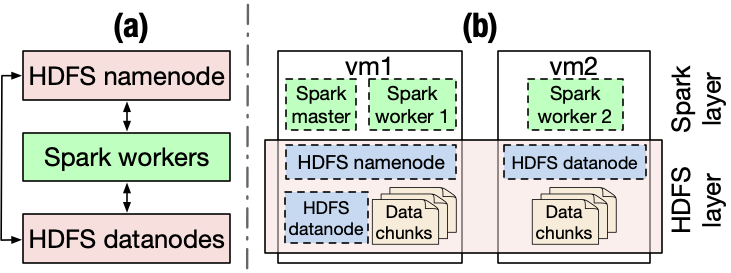

# CSC4160 Assignment 4: 

Deadline: 2024.11.10 23:59

***


## Overview
This assignment is designed to support your in-class understanding of how big data analytics stacks work and get some hands-on experience in using them. You will need to deploy Apache Hadoop Distributed File System (HDFS) as the underlying file system and Apache Spark as the execution engine. You will then develop several small applications based on them. You will produce a short report detailing your observations and takeaways.


## Part 0: Environment setup
You will complete this assignment in AWS Academy. In this assignment, you should create two EC2 VM instances of type `t3.large`. (Go ahead and create two EC2 instances of the same type and then rename them: hover over the instance name and click on the edit button to change name; with a meaningful name like `vm1` and `vm2` you can easily know which instance you are logging into.) You will then deploy a two-node HDFS cluster and a two-node Spark cluster on these two EC2 instances.

Both Hadoop HDFS and Spark use Java. So, as the first step, you should run the following commands on every EC2 instance to install Java. Ubuntu 22.04 LTS comes with `python3` (`Python 3.10.6`) installed. So you don’t need to manually install python yourself.

```bash
sudo apt update
sudo apt install -y openjdk-8-jdk
```

Then, you should enable password-free SSH service between the two EC2 instances. To do so, you need to generate a private/public key pair using:
```bash
ssh-keygen -t rsa
```
on the leader EC2 instance node (which we call `vm1`). The other EC2 instance will be assigned as follower. Then, manually copy the public key of `vm1` to the `authorized_key` file in both of the two instances (`vm1` **and** `vm2`) under `~/.ssh/`. To get the content of the public key saved in `id_rsa.pub`, do:

```bash
cat ~/.ssh/id_rsa.pub
```
Then copy the entire output of the above command to `authorized_key`. Make sure you do not append any newlines. Otherwise it will not work. **Also note that you should NOT overwrite the existing line in `authorized_key` file. Otherwise you will no longer be able to login to your VM**.

Once you are done with `vm1`, you should copy the content of `id_rsa.pub` in `vm1` over to `~/.ssh/authorized_key` in `vm2`. This way, the leader node `vm1` will have password-free SSH access to both itself and its follower node `vm2`.

> **IMPORTANT:** This is a critical step: if you do not complete this step, the startup script will not be able to remote start the HDFS/Spark daemon process on `vm2` (you will get permission denied error).

## Part 1: Software deployment



### Hadoop Distributed File System (HDFS)

[Apache Hadoop](https://hadoop.apache.org/) is a collection of open-source software utilities that provide simple MapReduce parallel programming models for batch processing of large datasets. It mainly consists of the Hadoop Distributed File System (HDFS), Hadoop MapReduce, and Hadoop YARN. In this assignment, we will only use HDFS. HDFS consists of a NameNode process running on the leader instance and a set of DataNode processes running on follower instances. The NameNode records file-system-level metadata and handles file data retrieval and storage requests. The DataNode processes store actual data.

Figure(a) above depicts a logical architecture of how Spark interacts with HDFS.

You can find the detailed deployment instructions in this [link](https://hadoop.apache.org/docs/stable/hadoop-project-dist/hadoop-common/ClusterSetup.html) or you can follow our simplified version:

### Step 1: Download the software
Let’s first download Hadoop on each of the two EC2 VM instances. Note that you can do this on vm1 and then `scp` (ssh-copy) to copy the downloaded software tar ball to vm2.

```bash
cd ~
wget https://archive.apache.org/dist/hadoop/common/hadoop-3.3.4/hadoop-3.3.4.tar.gz
tar zvxf hadoop-3.3.4.tar.gz
cd hadoop-3.3.4
```

### Step 2: Modify configuration files
There are a few configuration files that we need to edit. For HDFS, you can make edits on `vm1` and then copy the files to `vm2`. These configuration files are originally empty (with comments) so users need to manually set them. Add the following content to replace the empty `<configuration> ... </configuration>` field in `hadoop-3.3.4/etc/hadoop/core-site.xml`:

```xml
<configuration>
<property>
<name>fs.default.name</name>
<value>hdfs://namenode_IP:9000</value>
</property>
</configuration>
```

where `namenode_IP` refers to the **private** IP address of the EC2 instance.

> **NOTE**: You can use either the private IPv4 IP address or the public IPv4 DNS address. We recommend using the private IPv4 IP address as that will allow the data to go through private subnet. The **namenode_IP** can be found from the AWS Console: at AWS Console, click the corresponding EC2 instance, and copy the private IPv4 address from the instance summary.

Next, edit the file system directories in `hadoop-3.3.4/etc/hadoop/hdfs-site.xml`. Make sure you create the folders and specify the correct paths. For example, create `hadoop-3.3.4/data/namenode/` and `hadoop-3.3.4/data/datanode` and set each to be the path for the value of the `dfs.namenode.name.dir` field and `dfs.datanode.data`.dir field, respectively (see the template `hdfs-site.xml` configuration file listed below). The third configuration property indicates the size of the HDFS block, which in the example is set to 64MB. (By default HDFS is configured with a block size of 128MB.) These directories indicate where data for the NameNode and DataNode will be stored respectively. **Note** that the path in the xml file should be absolute; also **note** that the same path needs to be manually created by yourself on both the leader instance `vm1` and the follower instance `vm2`, because HDFS will run a DataNode process on each machine of the cluster.

```xml
<configuration>
<property>
<name>dfs.namenode.name.dir</name>
<value>/path/to/namenode/dir/</value>
</property>
<property>
<name>dfs.datanode.data.dir</name>
<value>/path/to/datanode/dir</value>
</property>
<property>
<name>dfs.block.size</name>
<value>67108864</value>
<description>Block size</description>
</property>
</configuration>
```

You also need to manually specify `JAVA_HOME` in `hadoop-3.3.4/etc/hadoop/hadoop-env.sh` so that HDFS can be launched. You can get the path with the following command:
```
update-alternatives --display java
```
Take the value of the current link and remove the trailing `/bin/java`. For example, a possible link can be `/usr/lib/jvm/java-8-openjdk-amd64/jre`. Then, uncomment line 54 in `hadoop-3.3.4/etc/hadoop/hadoop-env.sh` and set the `JAVA_HOME` by replacing `export JAVA_HOME=` with `export JAVA_HOME=/usr/lib/jvm/java-8-openjdk-amd64/jre`.

You also need to edit `hadoop-3.3.4/etc/hadoop/workers` to add the IP address of all the datanodes. Once again use the private IPv4 address. In our case for this assignment, you need to add two lines, each containing the IPv4 address of an EC2 instance corresponding to a datanode process. This way, the deployed HDFS can store data on both `vm1` and `vm2`. (Delete the existing `localhost` line in this file.)

### Step 3: Copy modified config files to the other EC2 instance
Then, copy the config files with these changes to `vm2` as well. For example:
```bash
scp hadoop-3.3.4/etc/hadoop/core-site.xml hadoop-3.3.4/etc/hadoop/hdfs-site.xml hadoop-3.3.4/etc/hadoop/workers hadoop-3.3.4/etc/hadoop/hadoop-env.sh ubuntu@<IP_of_vm2>:~/hadoop-3.3.4/etc/hadoop/
```
Where `ubuntu` is the user name on `vm2` and `<IP_of_vm2>` is the IP address of `vm2`.

### Step 4: Add Hadoop binary paths to $PATH and start the HDFS
Now, from within `vm1`, add the absolute paths of `hadoop-3.3.4/bin` and `hadoop-3.3.4/sbin` to `$PATH`. To do so, `echo` the `export` line to the end of `~/.bashrc` file and source it to make the changes effective:

```bash
echo 'export PATH="/home/ubuntu/hadoop-3.3.4/bin:/home/ubuntu/hadoop-3.3.4/sbin:$PATH"' >> ~/.bashrc
source ~/.bashrc
```
After this operation, you should be able to directly address all the binary executables of Hadoop that you have just installed.

Next, format the NameNode and start the NameNode and DataNode daemon processes on your cluster:

```bash
hdfs namenode -format
start-dfs.sh
```
This will format the HDFS data paths that you have just configured in Step 2 and start all the deamons.

To check the HDSF status over the HDFS dashboard, go to the following URL on your browser:

```bash
<public_IPv4_DNS_address_of_vm1>:9870/dfshealth.html
```
Where `public_IPv4_DNS_address` can be found in your AWS Console.

You can also use command `jps` to check whether HDFS is up and running. There should be a `NameNode` process that is running on `vm1`, and a `DataNode` process running on each of your two EC2 instnaces.

Now that your distributed HDFS cluster is all set, type the following to see the available commands that you can use to manage HDFS.
```bash
hdfs dfs -help
```

To stop the HDFS cluster, type:

```bash
stop-dfs.sh
```

### Apache Spark
[Apache Spark](https://spark.apache.org/docs/latest/index.html) is a powerful open-source analytics engine for big data processing. Spark is built on its core idea of [Resilient Distributed Datasets (RDDs)](https://www.usenix.org/system/files/conference/nsdi12/nsdi12-final138.pdf). Spark standalone consists of a set of daemons: a `Master` daemon, and a set of `Worker` daemons. Spark applications are coordinated by a `SparkContext` object, which will connect to the `Master`, which is responsible for allocating resources across applications. Once connected, Spark acquires `Executors` on every `Worker` node in the cluster, which are processes that run computations and store data for your applications. Finally, the application’s tasks are handed to `Executors` for execution. We will use Spark in standalone mode, which means that it does not need to rely on resource management systems like YARN.

Figure(b) above depicts a physical architecture of the HDFS and Spark deployment.

Instructions on deploying a Spark cluster can be found in Spark’s [official document](https://spark.apache.org/docs/latest/spark-standalone.html). Or you can follow our minimalist instructions as follows.

### Step 1: Download the software
First, download and decompress the Spark tar ball on each EC2 instance in the cluster:

```bash
wget https://archive.apache.org/dist/spark/spark-3.3.1/spark-3.3.1-bin-hadoop3.tgz
tar zvxf spark-3.3.1-bin-hadoop3.tgz
```

### Step 2: Modify configuration files
The downloaded Spark 3.3 provide template configuration files with a common suffix of `.template` in `spark-3.3.1-bin-hadoop3/conf/spark-env.sh`; just remove the suffix and make direct edits in them.

Spark 3.3 requires Python 3.7 or higher. AWS’ Ubuntu 22.04 LTS comes with `python3` (`Python 3.10.6`), and therefore, this dependency is already satisfied. Add the following lines to `spark-3.3.1-bin-hadoop3/conf/spark-env.sh` on both `vm1` and `vm2`:
```bash
export PYSPARK_PYTHON=/usr/bin/python3
export PYSPARK_DRIVER_PYTHON=/usr/bin/python3
```

Similar to HDFS, on `vm1` you will need to modify `spark-3.3.1-bin-hadoop3/conf/workers` to include the private IP addresses of all the worker machines (including both `vm1` and `vm2`).

Next, bind Spark to the private IP address by setting the `SPARK_LOCAL_IP` and `SPARK_MASTER_HOST` in `spark-3.3.1-bin-hadoop3/conf/spark-env.sh`. According to the comments in `spark-env.sh`, `SPARK_LOCAL_IP` will be set with the IP address Spark binds to on this node, and `SPARK_MASTER_HOST` will be set with the IP address of the master instance. You only need to do this on `vm1`. To do so, add the following lines to `spark-3.3.1-bin-hadoop3/conf/spark-env.sh`:

```bash
export SPARK_LOCAL_IP=<private_IPv4_address_of_vm1>
export SPARK_MASTER_HOST=<private_IPv4_address_of_vm1>
```

### Step 3: Start the Spark cluster
To start the Spark standalone cluster, run the following command on `vm1`:
```bash
spark-3.3.1-bin-hadoop3/sbin/start-all.sh
```

Go to `<public_IPv4_DNS_address_of_vm1>:8080` (Spark web dashboard) on your browser to check the status of the Spark cluster.

To check if the cluster is up and running, you can use `jps` to check that a `Master` process is running on `vm1` and a `Worker` process is running on each of your EC2 instances.

To stop the Spark cluster, run:
```bash
spark-3.3.1-bin-hadoop3/sbin/stop-all.sh
```
Next, setup the properties for the memory and CPU used by Spark applications. Set Spark driver memory to 4GB and executor memory to 4GB. Note that the `t3.large` EC2 instance has only 8GB of memory and 2 vCPU cores. Set executor cores to be 2 and number of cpus per task to be 1. Document about setting properties is [here](https://spark.apache.org/docs/3.3.0/configuration.html#spark-properties). One example configuration in `spark-3.3.1-bin-hadoop3/conf/spark-defaults.conf` is shown as follows:

```bash
spark.master                   spark://<private_IPv4_address_of_vm1>:7077
spark.driver.memory            4g
spark.executor.memory          4g
spark.executor.cores           2
spark.task.cpus                1
```

## Part 2: A simple Spark application
In this part, you will implement a Word Count program. We have provided some sample data that you can download from [this link](https://github.com/CUHKSZ-CSC4160-Fall24/Assignment-4/blob/main/wordcount.txt). Download the file to your home directory of `vm1`.

You then need to count the occurence of each word in the file. **Note** that the words in this file are separated by spaces. For example, in the sentence `Today, an activity named 'Gaming Today' is hosted.`, the words are: `Today,; an; activity; named; 'Gaming; Today'; is; hosted.`.

You should first load the data into HDFS by the following command:
```bash
hdfs dfs -copyFromLocal wordcount.txt /
```
Then, write a PySpark program in Python to count occurence of each word. Examples of self-contained applications in Python are given [here](https://spark.apache.org/docs/latest/quick-start.html#self-contained-applications).

We suggest you also go through the [Spark SQL Guide](https://spark.apache.org/docs/latest/sql-getting-started.html) and the [APIs](https://spark.apache.org/docs/3.3.0/api/python/index.html).

An example of a couple commands if you are using PySpark (Python API that supports Spark) that should be handy.
```python
from pyspark.sql import SparkSession

# The entry point into all functionality in Spark is the SparkSession class.
spark = (SparkSession
	.builder
	.appName("my awesome Spark SQL program")
	.config("some.config.option", "some-value")
	.master(master_URL:Port)
	.getOrCreate())
```

You can read the data from a file hosted on HDFS. An example HDFS path looks like the following: `hdfs://<the_IP_address_of_vm1>:9000/wourdcount.txt`.

In order to run your Spark application you need to submit it using `spark-submit` script from Spark’s `bin` directory. More details on submitting applications could be found [here](https://spark.apache.org/docs/latest/submitting-applications.html).

Finally, your application should output the results into HDFS in form of csv. It should take in two arguments, the first a path to the input file and the second the path to the output file. Note that if two data tuples have the same country code and timestamp, the order of them does not matter. See an example `spark-submit` command as follows:
```bash
bin/spark-submit /path/to/your_pyspark_app_part2.py <path_to_input_file> <path_to_output_file>
```
> **NOTE**: To view the status of your running application, click on the `Application ID` from your Spark UI webpage. It will bring you to the application status page. From there, click on `Application Detail UI` to view the details including application progress, DAG visualization, breakdown of the execution statistics, etc. A caveat with EC2 is that you will see a `We can’t connect to the server at ...` error after you click on `Application Detail UI`. To fix this, you will need to manually replace the private IPv4 address with the public IPv4 DNS address of the master EC2 instance (`vm1`) in order to view the application detail. Make sure to only modify the IP address and leave the `:4040` intact.

## Part 3: PageRank
In this part, you will implement the [PageRank algorithm](http://infolab.stanford.edu/~backrub/google.html) (§2.1) (or [the Wikipedia version](https://en.wikipedia.org/wiki/PageRank#Simplified_algorithm)), which is an algorithm used by search engines like Google to evaluate the quality of links to a webpage. The algorithm can be summarized as follows:
1. Set initial rank of each page to be 1.
2. On each iteration, each page p contributes to its outgoing neighbors a value of rank(p)/(# of outgoing neighbors of p).
3. Update each page’s rank to be 0.15 + 0.85 * (sum of contributions).
4. Go to next iteration.

In this assignment, we will run the algorithm on the [Berkeley-Stanford web graph dataset](https://snap.stanford.edu/data/web-BerkStan.html). We have also upload the decompressed dataset on the BlackBoard in case the original website is unavailable. Each line in the dataset consists of a page and one of its neighbors. You need to decompress the downloaded `.gz` dataset (using `gunzip`) and copy the input file to HDFS first. **In this part, always run the algorithm for a total of 10 iterations.**
- **Task 1.** Write a PySpark application that implements the PageRank algorithm.
- **Task 2.** In order to achieve high parallelism, Spark will split the data into smaller chunks called partitions, which are distributed across different nodes in the cluster. Partitions can be changed in several ways. For example, any shuffle operation on an RDD (e.g., `join()`) will result in a change in partitions (customizable via user’s configuration). In addition, one can also decide how to partition data when creating/configuring RDDs (`hint:` e.g., you can use the function `partitionBy()`). For this task, add appropriate custom RDD partitioning and see what changes.
- **Task 3.**  Kill a Worker process and see the changes. You should trigger the failure to a selected worker VM when the application reaches anywhere between *25% to 75%* of its lifetime (**hint:** use the `Application Detail UI` to track the application progress):
1. Clear the memory cache using `sudo sh -c "sync; echo 3 > /proc/sys/vm/drop_caches"` on `vm2`;
2. Kill the Worker process on `vm2`: Use `jps` to get the process ID (PID) of the Spark Worker on `vm2` and then use the command `kill -9 <Worker_PID>` to kill the Spark Worker process.

## Grading (8 points)

In this assignment, you are required to complete the following:
-  For Part 2, please fill the table below based on the execution results of your Word Count program (1 point)

    |**Word**|for|called|to|the|
    |:--:|:--:|:--:|:--:|:--:|
    |**Occurence**|7|4|29|46|

- Upload the code and execution log in Part 2. (1 point)

    I PUT THEM ON OTHER FILES IN THIS FOLDER
- For Part 3, please fill the table below based on the execution results of your PageRank program. Note that the Rank should retains 2 digits after the decimal point. (2 points)

    |**Node**|448126|49717|375375|63087|
    |:--:|:--:|:--:|:--:|:--:|
    |**Rank**|11.83|4.38|50.91|0.64|

- For Part 3, Task 2, explain the custom RDD partitioning you implemented and the changes it brings. (1 point)

    > I choose to use repartition method to partition the DataFrame，rather than partitionBy()。 Specifically, I used two strategies:
    Fixed Number of Partitions (repartition(4)):
    edges_df = edges_df.repartition(4)  
    out_degree_df = out_degree_df.repartition(4)
    ranks_df = ranks_df.repartition(4)

    Partitioning by Column (repartition("from")):
    edges_df = edges_df.repartition("from")
    out_degree_df = out_degree_df.repartition("from")
    ranks_df = ranks_df.repartition("id")

    Reasons for Choosing repartition(4) and repartition("from"):
    The Spark cluster consists of two EC2 instances (vm1 and vm2), each with 2 vCPU cores, totaling 4 cores. By repartitioning the data into 4 partitions, each core can process one partition simultaneously, maximizing parallel processing and resource utilization.
    Partitioning based on the from column ensures that all records with the same from value are located within the same partition. This is crucial for the join operations in the PageRank algorithm, as it minimizes the need for shuffling data across partitions.

    With repartition(4): ensuring that all processing units are utilized efficiently.
    With repartition("from"): Ensuring related data resides in the same partition enhances the efficiency of join operations.

- For Part 3 Task 3, explain the changes after the Worker process is killed. (1 point)

    > If I neither clear the memory nor terminate any workers, jobs initially start with only one running in parallel, gradually increasing over time until reaching a stable level of parallelism, with only a minimal amount of skipped stages. Eventually, all tasks successfully complete.

    When I clear the memory of worker 2 midway through execution, at the exact moment of clearing, all parallel jobs disappear. Some of the jobs manage to resume execution afterward, but a few stop completely and restart as new jobs. The rate of skipped stages increases slightly compared to the original speed, and the amount of data involved in shuffle-read and shuffle-write operations on disk significantly increases compared to when memory was not cleared — for example, shuffle-write grows from 830 MiB to 1.7 GiB. This eventually leads to memory exhaustion, causing a small portion of tasks to fail.

    When I terminate a worker, one executor is removed. As soon as I kill the worker, failed tasks and failed stages appear immediately, which further prevents one of the jobs from restarting promptly. It takes a long time before that job resumes, and during this period, parallelism decreases as tasks are queued onto the remaining executor. This overloads the remaining executor, leading to a sharp increase in its task failure rate. Ultimately, a large number of tasks end up failing.

- Upload the program and the corresponding execution logs for Task 1 and 2 in Part 3. (2 points)
    
    I PUT THEM OTHER PLACE IN THIS FOLDER


## Deliverables
You should submit a `zip` file to the Blackboard, which follows the naming convention of `LastName_FirstName_A4.zip`. The submitted file should include:

- a brief report (filename: LastName_FirstName.pdf)
- the code and execution logs with meaningful names of each task in each part

> **NOTE:** Even if you write your code using Jupyter Notebook, please do not submit the `.ipynb` Notebook file. Instead, you should submit the `.py` source file; to do so, copy each cell of your `.ipynb` into a `.py` file and ensure that it runs with the `spark-submit` command.

For the **report**, it should only contain the Grading Section of this file.


## FAQs
- If you have trouble accessing the web dashboard of HDFS/Spark, try the following trouble-shootings:
    - You should access the **public_IPv4_DNS_address** followed by colon and the port number instead of the public IPv4 address or private address.
    - If that does not work, check if you configured the `spark-3.3.1-bin-hadoop3/conf/spark-env.sh` file correctly.
    - If that still does not work, check the security group when you created the EC2 instances.
    - As a last resort, go ahead and create a new Security Group with `All traffic` and `0.0.0.0/0` and attach it to **BOTH** `vm1` and `vm2` instance (configuring `vm1` only will lead to Spark job hangs and HDFS not being able to replicate) and remove the old Security Group from `vm1` and `vm2`.
    Please refer to the Notebook Setup Tutorial if you need/want to use Jupyter Notebook for this assignment.

- If you want to use GitHub for saving your progress, refer to [this post](https://edstem.org/us/courses/32938/discussion/2565190?answer=5879823).

- You will need to have HDFS and Spark up and running so your program can run on Spark and access `wordcount.txt` stored in HDFS.

- `jps` is your friend – if you ever encounter errors or not being able to find an HDFS file, first check if you have your HDFS up and running. Likewise, if your code complains about not being able to connect to a Spark master, run `jps` to check if you have launched Spark already. **NOTE** here HDFS and Spark are server cluster programs but not an embedded library/package that you import and use. You need to launch them first before using them.

- If you mistakenly reformatted your HDFS NameNode more than once, you might end up not being able to launch your NameNode or DataNode as they have inconsistent VERSIONs. **FIX:** Go ahead and stop your HDFS, remove whatever files under your datanode and namenode folder, reformat the Namenode, and start HDFS again. **NOTE** you should not reformat NameNode after it’s up and running.

- Always use HDFS dash and Spark dash to monitor things. For example, if you repeatedly write same file to HDFS, it refuses to overwrite it simply because HDFS does not support in-situ overwrites. In this case, you can check under HDFS utilities tab if the file exists on the associated path.

- **Spark Job Hanging:** If your PageRank code runs forever and won’t finish, the most likely culprit is that you have a previously sbmitted Spark job not stopped. Use Spark Dash to monitor any hanging job. If any, kill it or stop it using `spark.stop()`. This would occur mostly likely when you use an interactive Notebook session: when you do interactive debugging, you forget to hit the cell that contains the `spark.stop()` statement; and that submitted job won’t be automatically removed and that blocks your next job.

## Acknowledgments
This assignment uses insights from Professor Shivaram Venkataraman’s assignment 1 of CS 744 Fall 2019 and Professor Yue Cheng's assignment 1 for DS5110 Spring 2023.
